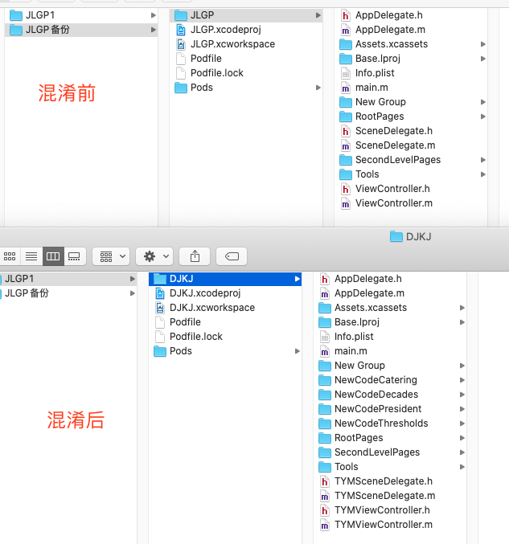
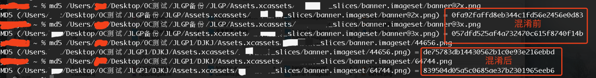
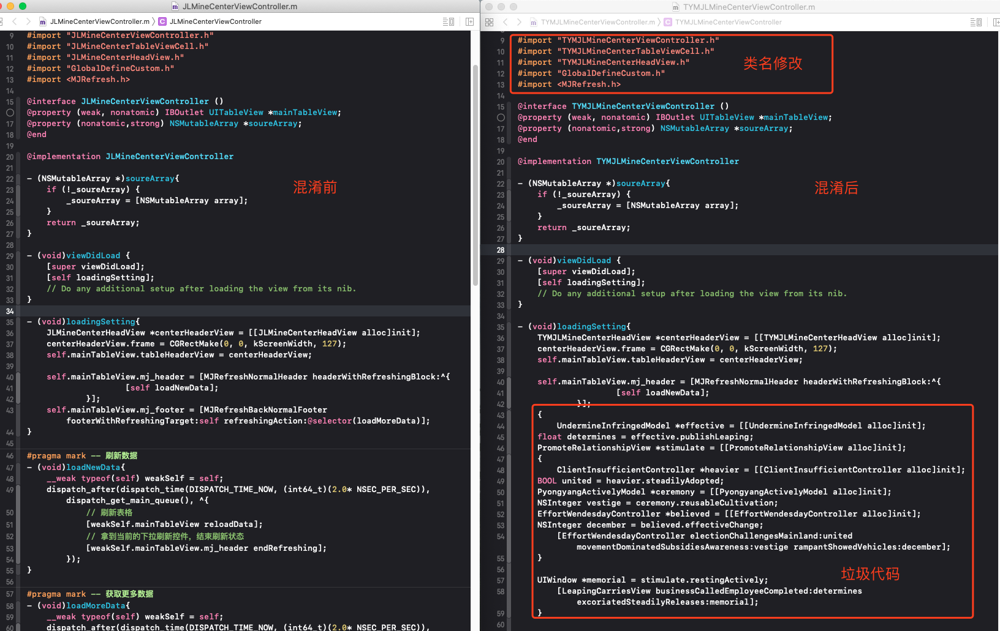

## 更新日志
* version 1.0.0  2020-05-27  工具首发,暂只支持OC项目混淆
* version 1.1.0  2020-06-03  优化OC混淆逻辑和规则，新增Flutter项目混淆支持
* version 1.2.0  2020-06-05  新增React Native项目混淆支持
* version 1.3.0  2020-07-01  优化混淆逻辑，开放免费版本
* version 1.4.0  2020-07-03  RN混淆功能暂时关闭；工具界面可拉伸缩放
* version 1.5.0  2020-07-09  增加混淆日志文档功能；部分UI显示优化
*                2021-01-04  正式版本发布   
* [正式版本下载地址](https://github.com/YYConfuse/YYConfuse)

## 链接导航
* [版本更新功能说明](https://shimo.im/docs/RhxX6yP6hkctTyyP/)
* [为什么要做iOS源码混淆](https://shimo.im/docs/j9kvvykc33RDRr8w/)
* [工具使用教程-OC](https://shimo.im/docs/XwD9XVvp6CK9Gj9v/)
* [工具使用教程-Flutter](https://shimo.im/docs/68xDRkVxPdgQJvVG/)
* [工具使用教程-React Native](https://shimo.im/docs/TdGyDR9XCP8XDvH8/)

# 摘要
本工具免费使用，各位的star和支持，是本人更新维护，功能扩展的动力，谢谢各位支持。

iOS混淆 iOS代码混淆 iOS过审工具 iOS上架 iOS代码混淆工具 iOS工具 iOS马甲包 iOS马甲包工具 iOS混淆 iOS过4.3 iOS过审 iOS confuse iOS code confuse iOS2.3.1解决 iOS账号调查解决办法 iOS账号调查解决 iOS账号调查过审 OC代码混淆 IOS源码混淆 OC混淆 OC代码混淆 OC过审工具 OC代码混淆工具 OC工具 OC马甲包 OC马甲包工具 OC混淆 OC过4.3 OC过审 OC confuse OC code confuse OC解决  OC代码混淆 IOS源码混淆 Flutter源码混淆 Flutter混淆  Flutter代码混淆  Flutter confuse  Flutter马甲包工具  Flutter过审工具 Flutterg提审 Flutter审核 RN源码混淆 RN混淆  RN代码混淆  RN confuse  RN马甲包工具  RN过审工具 RN提审 RN审核  React Native 混淆

# 前言
我们长期给用户提供上架技术支持,上架解决方案。有感于目前苹果加大了审核力度,导致诸多开发者苦不堪言。由此,我们开放了此工具,以帮助诸多开发者解决上架过程中遇到的各种问题。

# 工具介绍
1. 项目名修改
2. 项目目录结构差异化调整
3. 类名，文件名修改，类文件hash值修改
4. 图片，bundle，xib等资源文件文件名，hash值修改
5. 新增全新代码文件，新增类文件相互调用引用
6. 在原源码中，添加对新增代码的引用调用
7. 在原源码中，新增新的函数方法实现
8. 用户自定义混淆词库
9. 词库敏感词过滤功能
    
# 图文介绍
* 项目名修改  项目目录结构改变 

* 资源  文件 MD5修改

* 资源名  文件名修改

* 源码中插入混淆代码  新建全新混淆代码

# 我们的优势
1. 免费使用，目前很多工具是收费工具，其中有很大一部分，付了钱没法用
2. 相较于使用python的脚本工具而言，我们有MAC版的可操作界面，只需要会iOS开发，即可使用，不需要额外去学习python，使用门槛低，刚入门小白也能成上架大神
3. 本工具作者也长期使用，长期维护，确保对各位开发者提包有帮助，经得起检验
4. 作者对苹果上架机制了解透彻，工具功能都是针对性的，混淆逻辑是独家独有（不排除被模仿）
5. 独家图片处理机制，不改变图尺寸，不改变图像素（无法被模仿，目前常见的混淆工具对图片的处理要么依靠脚本实现，要么就是对图片进行格式转换来改变图片MD5，造成图片严重失真）
6. 工具支持OC,Swift,RN,Flutter等应用项目混淆。更支持cocos，unity等游戏项目混淆。支持范围广泛，适用场景全面。
7. 独家敏感词检测功能，规避常见的由于敏感词导致的2.3.1拒审。
8. 本人看到很多混淆工具有删除注释行的功能，但是我们没有删除，这都是噱头。第一，删除了注释行，代码基本不再具备可维护性，可读性为0  第二，Xcode打包机制，已经在打包的时候把注释行进行了删除，没必要多次一举
9. 无虚假宣传，一套代码成功上架百次，结果才是硬道理

# 使用前必看
1. 本工具免费提供使用，一切要求收费的都是骗子
2. 本工具支持MACOS 10.10及以上系统版本
3. 本工具主要辅助解决代码导致的4.3，2.1，2.3.1，账号调查等问题，并且长期维护更新
4. 本工具为上架辅助工具，不能保证一定过审，只是大概率提高过机审概率，使用前请悉知
5. 混淆前请务必备份源码
6. 使用前请详细阅读[工具使用教程](https://shimo.im/docs/9VdKGkWqP36Tr3GX/read),以免造成损失
7. 工具支持语言视需求进行扩展开发,更多语言支持正在开发中,敬请期待

## 无法打开或者打开就闪退
如果打开提示->XXX.app 已损坏,打不开。您应该将它移到废纸篓 ” 或 “ 打不开 XXX.app,因为它来自身份不明的开发者
1. 打开终端（Terminal.app）
2. 拷贝粘贴 sudo spctl --master-disable,按回车键
3. 输入你的账户密码,按回车键确认执行（该密码不会显示,直接输入即可）

## 如已经开启任何来源,但依旧打不开（macOS Catalina 10.15以上会遇到）
1. 在系统的“安全与隐私”中允许“任何来源”,再打开终端
2. 输入以下命令,回车(注意路径根据自己的实际情况替换)
sudo xattr -d com.apple.quarantine /Applications/ALL_RoundU.app
1. 重启App即可.

